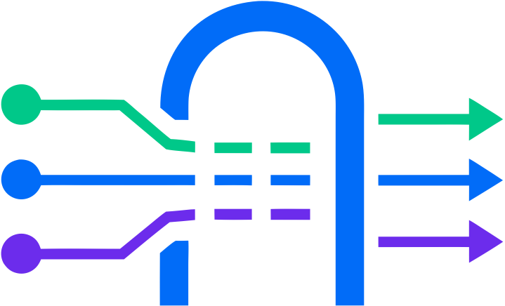

<p align="center">
    
</p>

<h1 align="center">mcp-gtw-provider</h1>

<p align="center">
    The framework-agnostic JavaScript client for mcp-gtw — a small, dependency-free ES module that
    publishes and runs your MCP tools, resources, prompts and more from any web app over WebSocket.
</p>

<p align="center">
    <a href="https://github.com/mcp-gtw/mcp-gtw-provider/actions/workflows/ci.yml"></a>
    <a href="https://www.npmjs.com/package/mcp-gtw-provider"></a>
    <a href="LICENSE.md"></a>
</p>

---

There is no dependency on React, Vue, or any DOM framework — it uses only standard web platform APIs
(`WebSocket`, `AbortController`, timers). Import it into a plain HTML page, or wire it into React,
Vue, Svelte, or anything else.

## 🔌 How it fits

An MCP client talks to the gateway over Streamable HTTP. The gateway never knows the capabilities in
advance — this provider connects from your app, registers them, and executes their handlers:

```text
MCP client  ⇄  mcp-gtw (/mcp)  ⇄  gateway (/provider)  ⇄  McpGtwProvider (your app)
```

## 📦 Install

```bash
npm install mcp-gtw-provider
```

No build step is required — it ships as ES modules. You can also import the file directly in a page.

## 🚀 Quick start

```javascript
import { McpGtwProvider } from "mcp-gtw-provider";

// the gateway hands you this token when it opens a channel for your app
const token = await fetchGatewayToken();

const provider = new McpGtwProvider({
    url: `wss://your-gateway.example.com/provider?token=${token}`,
    onStatusChange: (status) => console.log("gateway:", status),
});

provider.registerTool(
    {
        name: "add",
        description: "Add two numbers",
        inputSchema: {
            type: "object",
            properties: { a: { type: "number" }, b: { type: "number" } },
            required: ["a", "b"],
            additionalProperties: false,
        },
    },
    async ({ a, b }) => a + b,
);

await provider.connect();
```

The handler's return value is wrapped into an MCP result automatically: a string becomes text, an
object becomes text plus `structuredContent`, and returning a full `{ content: [...] }` object gives
you exact control. Throwing turns into an error result.

## 📚 Documentation

| Guide | What it covers |
| --- | --- |
| [Usage](docs/usage.md) | Every constructor option, tools, resources, prompts, completion, logging, progress, sampling, elicitation, lifecycle. |
| [Protocol](docs/protocol.md) | The private WebSocket frames this module speaks. |
| [Frameworks](docs/frameworks.md) | Using it from vanilla JS, React, and Vue. |

## ✅ Requirements

- A browser, or any runtime with `WebSocket`, `AbortController`, and timers.
- Node 20+ only to develop this package — tested on 20, 22 and 24 in CI.
- A running [`mcp-gtw`](https://github.com/mcp-gtw/mcp-gtw) to connect to.

## 💜 Support

If this project saved you time, consider supporting it:
[GitHub Sponsors](https://github.com/sponsors/paulocoutinhox) · [Ko-fi](https://ko-fi.com/paulocoutinho).

Made with care by [Paulo Coutinho](https://github.com/paulocoutinhox).

Licensed under [MIT](LICENSE.md).
